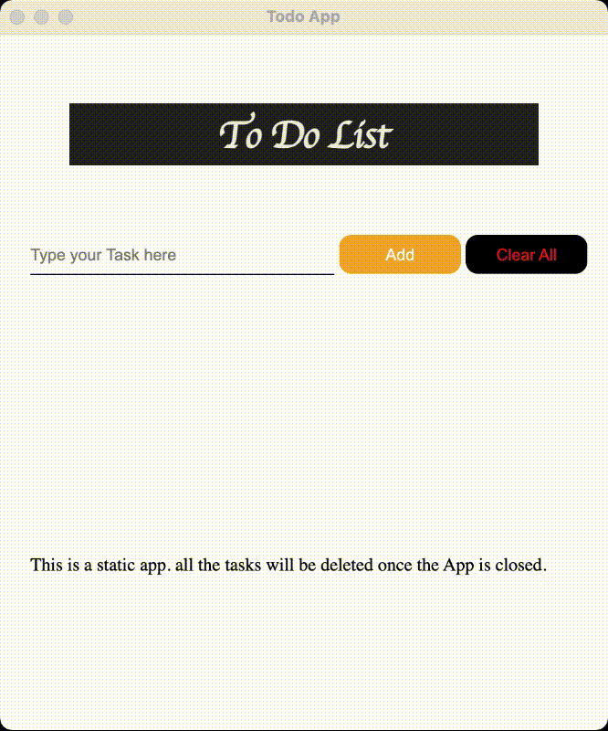

## Electron To-do App created using Electron JS

* This is a Static App which has no memory/ is not connected to any Database to store the tasks
* All the tasks added manually will be deleted once the app is closed 
* only first two tasks will persist since they are hard coded for demo purpose
* this App is created to Learn Electron JS.

### default App Logo on darwin platform (mac os)

### APP UI 

### App Demo
